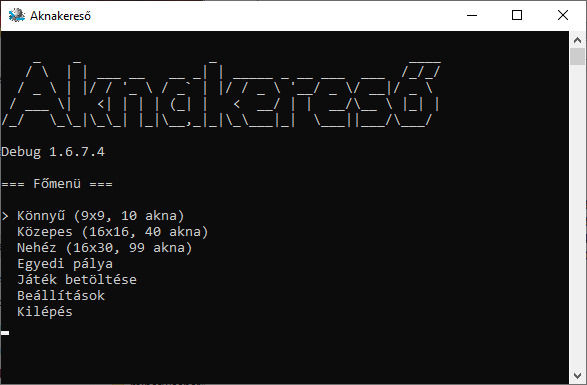
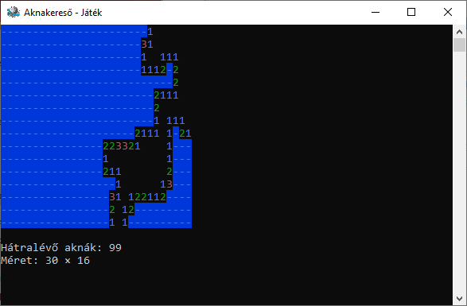

```
    _    _                _                        ____ 
   / \  | | ___ __   __ _| | _____ _ __ ___  ___  /_/_/
  / _ \ | |/ / '_ \ / _` | |/ / _ \ '__/ _ \/ __|/ _ \ 
 / ___ \|   <| | | | (_| |   <  __/ | |  __/\__ \ |_| |
/_/   \_\_|\_\_| |_|\__,_|_|\_\___|_|  \___||___/\___/ 
```
# Játékszabály

**A játék elmélete:** A játék elején minden cella le van fedve. A cellákban lehetnek aknák, számok, de lehetnek üresek is. A számok azt mutatják, hogy körülöttük lévő 8 mezőben hány akna található.\
**A játék célja:** Jelöld be zászlókkla az összes aknát, vagy fedd fel az összes mezőt ami nem akna.\
**A játék menete:** Bárhol lehet kezdeni egy pályát. A pályakezdéskor garantáltan nem lehet kiválasztani aknás mezőt. Addig fedsz fel területet és zászlózol be amég minden aknát be nem jelölsz. Ha aknára nyomsz, akkor felrobbansz és új játékot kezdhetsz.

## Telepítés
Az Aknakereső telepítője letölthető [innen](inno-setup/scripts/Output/minesweeper_setup.exe).

## Irányítás
- Kurzor mozgatás: `Nyílgombok`  
- Mező kiásása: `W`  
- Mező bezászlózása: `Space`  
- Kilépés a menübe: `Escape`

Beta 1.6.3 -tól már álítható a menüben.

## Hibák
Itt tudod a hibákat megnézni és új hibát jelenteni: [GitHub Issues](https://github.com/vgeri108/minesweeper/issues)

## Képernyőképek

